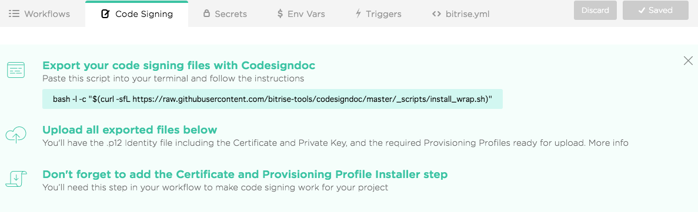
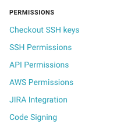

# Исходная настройка каждого CI
Для каждого из следующих облачных CI он указывает, как инициализировать файл p12 и профиль Provisioning Profile, чтобы вы могли создавать приложение.

# Предварительная работа
Для каждого CI существует разница в том, легко ли вы выполняете следующую работу или выполняете ли вы это самостоятельно.

- При создании приложения iOS вам необходимо иметь файл p12 и профиль Provisioning Profile.
- файл p12 должен быть зарегистрирован в цепочке ключей.
- Профиль предоставления должен находиться в определенном месте.

### Битрейт

#### Настройка из Интернета


Вы можете загрузить требуемый файл p12 и профиль Provisioning Profile на экран настроек выше.
Если вы не знаете файл, вы можете получить необходимые файлы с помощью приведенной ниже команды, поэтому загрузка полученного файла в порядке.

```
bash -l -c "$ (curl -sfL https://raw.githubusercontent.com/bitrise-tools/codesigndoc/master/_scripts/install_wrap.sh)"
```

### CircleCI

#### Настройка из Интернета


Вы можете загрузить файл p12 и профиль Provisioning Profile из «Подписи кодов» на экране настроек.

### Travis CI
В Travis CI вы не можете делать настройки с веб-страниц, вам нужно сами управлять файлами и сами ударять по команде.

#### предварительная подготовка
Предварительные приготовления заключаются в следующем.

1. Установите команду travis
  - `gem install travis - no - document`
  - `travis login`
  - `travis enable`
1. Подготовьте файл p12 и профиль Provisioning Profile
  - Установить парольную фразу для файла p12
1. Скопируйте файл, подготовленный в 1 в tar
  - `tar cvf secrets.tar dist.p12 sample.mobileprovision`
1. Зашифровать полученный tar-файл
  - `travis encrypt-file secrets.tar secrets.tar.enc`
  - Скопировать строку символов, отображаемую после выполнения
    - Пример: `openssl aes-256-cbc -K $ encrypted_xxxxx_key -iv $ encrypted_xxxxx_iv -in ./travis/secrets.tar.enc -out./travis/secrets.tar -d`
    - Значение ключа $ encrypted \ _ xxx x x \ _ уже установлено
 1. Зашифрованные файлы управляются на github

Получение #### Фастлан
Fastlane позволяет вам создавать брелки и создавать приложения.

 - [Пример Fastlane] (https://github.com/tarappo/ci-sample-ios/blob/master/fastlane/Fastfile)


`` `
lane: setup_certificate сделать
  keychain_name = "ios-build.keychain"
  keychain_password = SecureRandom.base64

  create_keychain (
      имя: keychain_name,
      пароль: keychain_password,
      default_keychain: true,
      unlock: true,
      таймаут: 3600,
      add_to_search_list: true
  )

  import_certificate (
      certificate_path: "travis / dist.p12",
      certificate_password: ENV ["KEY_PASSWORD"],
      keychain_name: keychain_name,
      keychain_password: keychain_password
  )
конец
`` `
[Цитата от официального представителя Travis CI] (https://docs.travis-ci.com/user/common-build-problems/#Mac%3A-macOS-Sierra- (10.12) -Code-Signing-Errors)

#### Установка переменных среды
 - KEY_PASSWORD
   - Установить набор фразы при выводе файла p12
 - GYM_CODE_SIGNING_IDENTITY
   - идентификация подписи кода
   - Пример) Распространение iPhone: xxxxxx

Приготовление ####. Travis.yml
После подготовки всего вышеподготовьте `.travis.yml`.

Подробности описаны в [.travis.yml] (https://github.com/tarappo/ci-sample-ios/blob/master/.travis.yml), но некоторые из них подбирают и объясняют Встать.

После декомпрессии сделайте настройки вокруг keychain с помощью fastlane, а затем установите профиль Provisioning Profile в определенном месте.

`` `
before_script:
  - bundle exec fastlane setup_certificate
  - mkdir -p ~ / Library / MobileDevice / Provisioning \ Profiles
  - cp ./travis/*mobileprovision ~ / Library / MobileDevice / Provisioning \ Profiles /
`` `

После этого все нормально, если вы создадите приложение.


### NEVERCODE

#### Настройка из Интернета

![Экран настройки NEVERCODE] (img / nevercode-setting.png)

Вы можете загрузить файл p12 и профиль Provisioning Profile из «Подписи кодов» на экране настроек.

### buddybuild
#### Настройка из Интернета
! [setup setup setup] (img / buddybuild-setting.png)

Вы можете загрузить файл p12 и профиль Provisioning Profile из «Подписи кода» на экране настроек.
